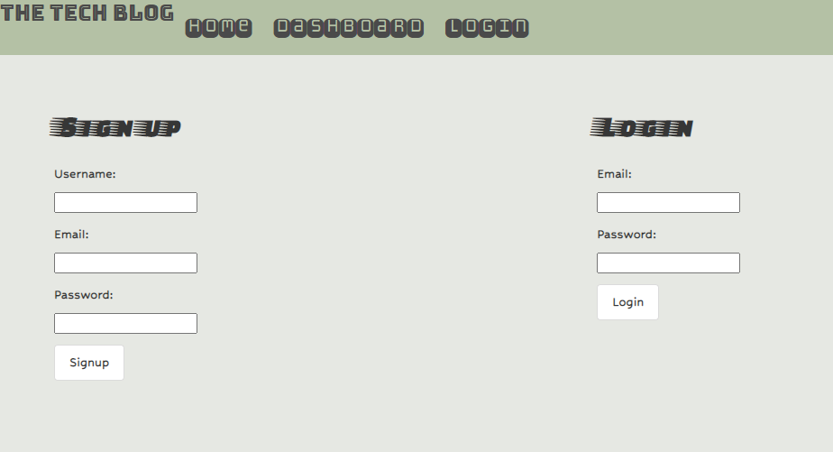
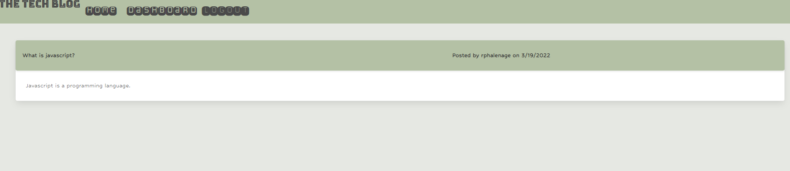
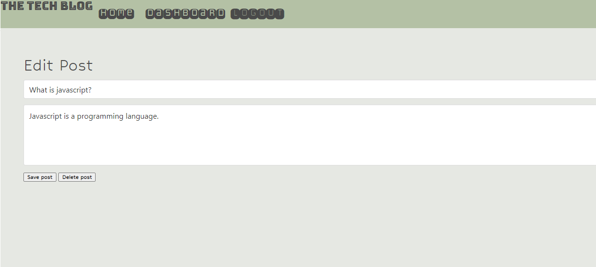

# The Tech Blog

The tech blog allows a user to sign up or login. A user is able to view the blog posts and comments without being logged in. A user must be logged in to comment on a post and to create, edit, and delete a post.







To view the site visit, [The Tech Blog](https://cryptic-brook-73251.herokuapp.com/)

View a demo here, [Demo](https://drive.google.com/file/d/1rdR09luCZ548IudGUbTh1ZEow_5oZr6O/view)

## Getting started

You will need to have node installed.
Clone this repo and run npm install to install the dependencies.
You will need to create a .env file. Inside this file you will store these variables:

```
DB_NAME='dbtechblog'
DB_USER='YourUserHere'
DB_PW='YourPasswordHere'
SESSION='YourSessionPasswordHere'
```

## Technologies used

- Node js
- Javascript
- Express
- Sequelize
- Sessions
- Handlebars
- Bulma
- MySQL2
